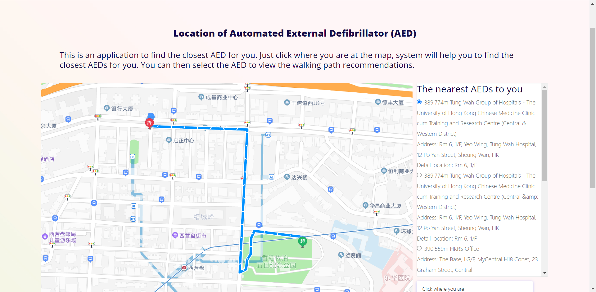
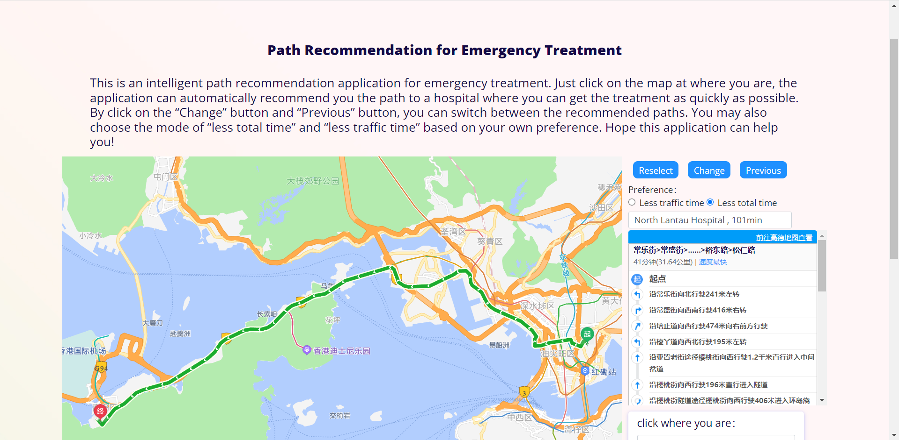
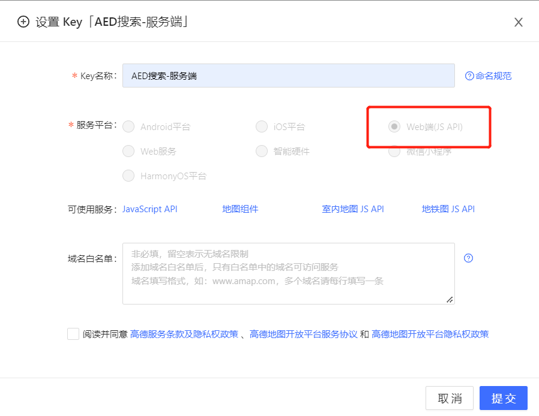
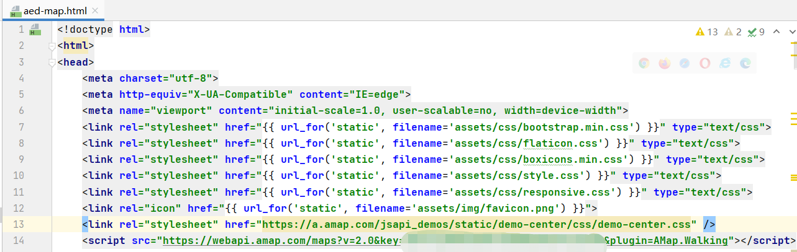
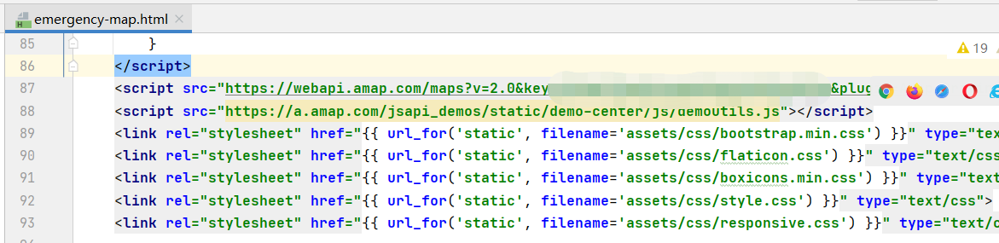
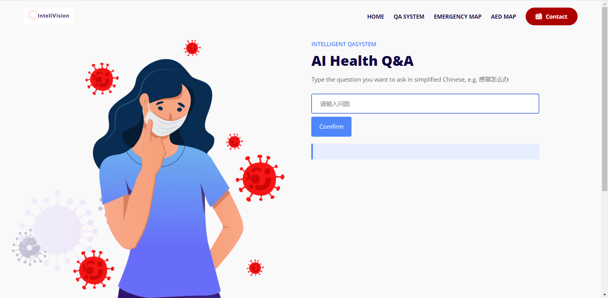

# Intelligent Medical Visualiztion System

## Introduction
This is our MSC Program of HKU named Intelligent Medical Visualization System. We are committed to providing convenience to users by visualising medical data. There are 3 applications, Intelligent QA System, Emergency Map and AED Map .Hope our applications can help you!  


## Environment
* Python3
* Windows/Linux/macOS
## Main requirements
* tensorflow 1.13.1
* flask 2.1.2
* pandas 1.3.5
* py2neo 2021.2.3
## Map Services Setting
### Apply Gaode Map API Keys
[console.amap.com](https://console.amap.com/)
#### JS API Key
* Apply JS API Key  

### Add Keys to Code
* Copy and paste JS API Key to 'templates/aed-map.html'
  
* Copy and paste JS API Key to 'templates/emergency-map.html'  
  
## Fast running
```python app.py```
## Running Intelligent QA System
* [Download data](https://drive.google.com/file/d/1oD1edDnRgYgF88iMd0nI1XXRNvVbi9ke/view?usp=sharing)
* [Start Neo4j Database](https://blog.csdn.net/weixin_44023658/article/details/112542982)
* Build Knowledge Graph  
  ```cd QASystem```  
  ```python build_grapy.py```
* Running with Intelligent QA System  
 ```python app.py -q 1```  
  
## Personalised running
```python app.py [-q] [-e] [-a]```
* -q Whether to use Intelligent QA System
* -e Cycle time for obtaining emergency map data
* -a Cycle time for obtaining AED map data

